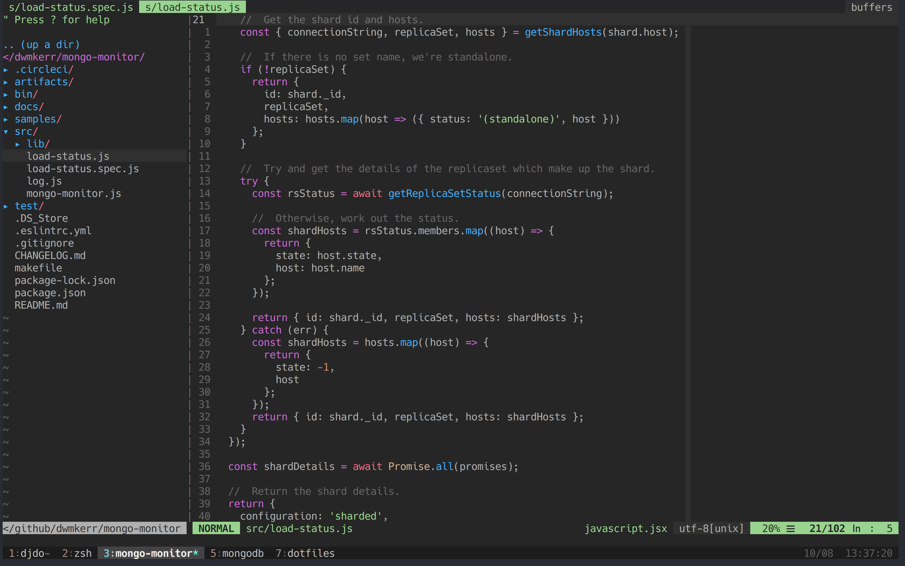
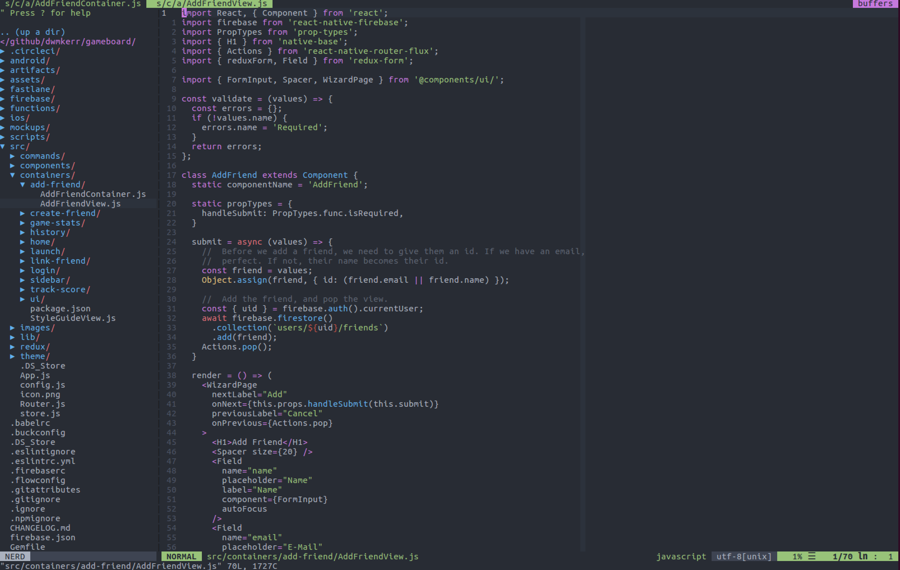

# dotfiles

My setup for MacOSX and Linux, with a focus on terminal, editor, shell, programming environments etc.

**Screenshot on MacOSX**



**Screenshot on Ubuntu**



<!-- vim-markdown-toc GFM -->

* [Introduction](#introduction)
* [Quick Start - Clean MacOSX Machine](#quick-start---clean-macosx-machine)
    * [Manual Steps](#manual-steps)
* [Ubuntu Terminal Configuration](#ubuntu-terminal-configuration)
* [iTerm 2 Configuration](#iterm-2-configuration)
* [Shell Commands](#shell-commands)
* [Cheat Sheet - TMux](#cheat-sheet---tmux)
* [Cheat Sheet - Vim](#cheat-sheet---vim)
    * [Plugins](#plugins)
* [Tooling Choices](#tooling-choices)
    * [Vim](#vim)
* [TODO](#todo)

<!-- vim-markdown-toc -->

## Introduction

The goal of this project is to provide a single command which will setup key features of the system. Each feature should be _orthogonal_ and not depend on other features.

The following is set up:

- `zsh` as the default shell
- `tmux` for terminal multiplexing, with my preferred theme and settings
- `vim` as the default editor, with my preferred theme and settings
- `~/.private` as a folder excluded from version control, the contents of which are always loaded on shell startup (ideal for project specific secrets etc)
- `~/.profile` as a version controlled folder, the contents of which are always loaded on shell startup

## Quick Start - Clean MacOSX Machine

On a _completely clean_ Mac, run the following commands in a terminal.

```sh
# Install commandline tools (so that we have git).
xcode-select --install

# Create a working environment, in my standard format.
cd ~
mkdir -p repos/github/dwmkerr
cd repos/github/dwmkerr

# Clone the dotfiles - note that a new machine will not have my SSH key
# so this is over https.
git clone https://github.com/dwmkerr/dotfiles.git
cd dotfiles
./setup.sh
```

### Manual Steps

There are a number of manual post-install steps:

1. Restore GPG keys from a backup.
0. Setup SSH keys for GitHub.
0. Load the iTerm and Terminal 'One Dark' colour schemes from the `terminal` folder.
0. Restore Parallels virtual machines from backup.
0. Actually install tmux plugins, using `<leader> Ctrl+I` (otherwise things like `tmux-yank` won't work).
0. Restore the `~/.private/` folder from a secure backup, to bring back project specific secrets.
0. Restore the AWS CLI credentials to bring back project access.
0. Setup SSH keys for GitHub.
0. Load the iTerm and Terminal 'One Dark' colour schemes from the `terminal` folder.
0. Restore Parallels virtual machines from backup.
0. Configure `~/.gitconfig` from `./git/gitconfig`.
0. Setup Vim NGINX syntax: https://arian.io/vim-syntax-highlighting-for-nginx/

## Ubuntu Terminal Configuration

Set the [OneDark Theme](https://github.com/denysdovhan/one-gnome-terminal) with:

```sh
bash -c "$(curl -fsSL https://raw.githubusercontent.com/denysdovhan/gnome-terminal-one/master/one-dark.sh)"
```

## iTerm 2 Configuration

I've not yet been able to script this configuration. Here are the settings which are non-default:

- General: Selection - [X] Applications in terminal may access clipboard
- General: Window    - [ ] Native full screen windows
- Profiles: Text     - [X] Blinking cursor
- Profiles: Text     - Font: 16 pt Hack
- Profiles: Window   - Transparency: ~15%
- Profiles: Window   - Style: Fullscreen
- Profiles: Terminal - [X] Silence bell
- Profiles: Keys     - Left ⌥ key 'Esc+'
- Keys: HotKey       - [X] Show/hide all windows with a system-wide hotkey (⌥ +Space)

## Shell Commands

The following shell commands are setup:

| Command         | Usage                                                                |
|-----------------|----------------------------------------------------------------------|
| `serve`         | Serve the current folder over HTTP on port 3000.                     |
| `restart-shell` | Restart the current shell, reloading `~/.private`, `~/.profile` etc. |

## Cheat Sheet - TMux

| Command             | Usage                                                |
|---------------------|------------------------------------------------------|
| `Ctrl + h/j/k/l`    | Navigate splits (vim aware)                          |
| `move-window -r`    | Re-order the tab numbers (useful if there are gaps). |
| `<leader> / Ctrl+S` | Save Tmux Session                                    |
| `<leader> / Ctrl+R` | Restore Tmux Session                                 |
| `<leader> /`        | Last split                                           |
| `<leader> h`        | Move window left                                     |
| `<leader> l`        | Move window right                                    |
| `<leader> {`        | Swap pane left                                       |
| `<leader> }`        | Swap pane right                                      |

## Cheat Sheet - Vim

Here's a quick reference. My `<Leader>` is `\`, so I've written shortcuts as `\x` rather than `<Leader>x` for brevity. I still need to port the above to the structure below.

| Command                              | Usage                                                                   |
|--------------------------------------|-------------------------------------------------------------------------|
| `\[<Space>`                          | blank line above                                                        |
| `]<Space>`                           | blank line below                                                        |
| `sj`                                 | Splitjoin down (i.e. split a line downwards).                           |
| `sk`                                 | Splitjoin up (i.e. join a line upwards).                                |
| `<leader>r`                          | Open current file in NERDTree.                                          |
| `<leader>w`                          | Write buffer.                                                           |
| `<leader>\\`                         | Open buffer in new tab.                                                 |
| `<leader>d`                          | Open word under cursor in Dash.                                         |
| `<leader>t`                          | Show current buffer in NERDTree.                                        |
| `:Tabularize /=`                     | Line up selection, using '='                                            |
| `gd`                                 | where possible, will go to a local definition.                          |
| `<leader>f`                          | Toggle focus mode.                                                      |
| **Navigation**                       |                                                                         |
| `gx`                                 | Open link or address under cursor.                                      |
| **Spelling**                         |                                                                         |
| `]s` and `[s`                        | Next/Previous spelling error.                                           |
| `z=` and `zg`                        | Check dictionary / add to dictionary.                                   |
| **Markdown**                         | Provided by `vim-markdown`                                              |
| `]]` and `[[`                        | Next and previous headers.                                              |
| `gx`                                 | Open link in standard editor.                                           |
| **Focus**                            | From `vim-goyo` and `vim-limelight`                                     |
| `:Goyo`                              | Enter focus mode.                                                       |
| `:Limelight 0.8` and `:Limelight!`   | Go into limelight, 80% ultra focus, and toggle limelight.               |
| `let g:limelight_paragraph_span = 1` | Span more paragraphs in limelight.                                      |
| **Markdown Tables**                  |                                                                         |
| `\tm`                                | Enter/Exit 'table mode', which will dynamically format markdown tables. |
| `ci｜`                               | Example of the `｜` motion for cells - i.e. 'change-in-cell'.           |

Note: including the vertical pipe `|` in the table above would cause rendering issues. So instead, the unicode character `｜` is used to illustrate the commands. Do not use the unicode character, use the normal ASCII 0x7C character.

### Plugins

This is a new list, it'll take some time to bring others up to date.

 - [vim-table-mode](https://github.com/dhruvasagar/vim-table-mode) to aid with dynamic formatting of markdown tables

## Tooling Choices

### Vim

*Why Vim Plug over Vundle?*

I was impressed enough with the comments on [this post](https://erikzaadi.com/2016/02/11/moving-from-vundle-to-vim-plug/) to make the switch, particularly as [coc](https://github.com/neoclide/coc.nvim) doesn't support Vundle, meaning I had to give Plug a try.

## TODO

- [ ] Autocomplete for docker/k8s is still not properly setup.
