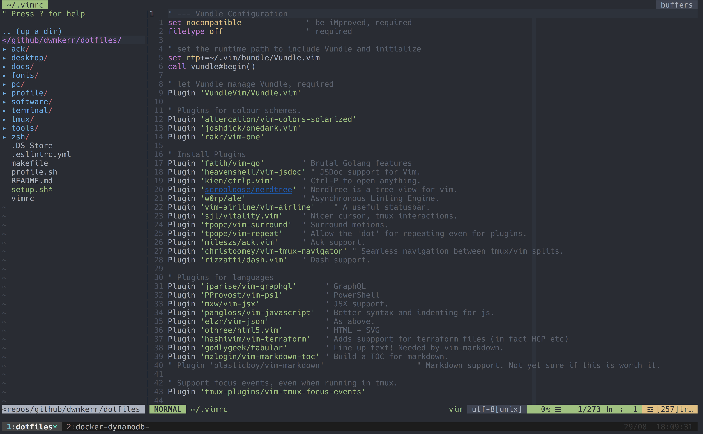

# dotfiles

This repository contains all of my configuration for MacOS and Linux, with a focus on terminal, editor, shell, programming environments etc. This repository can easily be forked to allow you to create and customise your own machine setup.

Some key features are:

- Support for setting up a clean machine with developer focused tooling
- The ability to choose what features you do or don't install
- Idempotent setup, which allows you to run the setup whenever you want to add or upgrade features
- Small, simple scripts to setup 'features', such as Ruby and `rbenv`, Python, Vim and so on
- Small, simple scripts which are sourced into your shell profile, providing things like auto-completion
- Management of dotfiles such as `~/.vimrc` and `~/.gitconfig`
- Optional management of private file, such as SSH keys, as long as you have access to an AWS S3 bucket

⚠️ **Warning**: I have tried wherever possible to ensure no _destructive_ change will happen when working with the scripts or commands in this project, without explicit user intervention (i.e. the user typing `yes` to make changes). The goal is that you can run the setup scripts without changing _anything_ unless you explicitly choose a feature. However, I cannot guarantee I haven't made an mistakes, so please exercise caution.

**Screenshot on MacOSX**



**Screenshot on Ubuntu**


<!-- vim-markdown-toc GFM -->

* [Introduction](#introduction)
* [Quick Start](#quick-start)
* [Features](#features)
* [Developer Guide](#developer-guide)
* [Ubuntu Terminal Configuration](#ubuntu-terminal-configuration)
* [iTerm 2 Configuration](#iterm-2-configuration)
* [Shell Commands](#shell-commands)
* [Cheat Sheet - TMux](#cheat-sheet---tmux)
* [Cheat Sheet - Vim](#cheat-sheet---vim)
    * [Plugins](#plugins)
* [Tooling Choices](#tooling-choices)
    * [Vim](#vim)
* [TODO](#todo)

<!-- vim-markdown-toc -->

## Introduction

The goal of this project is to provide a single command which will setup key features of the system. Each feature should be _orthogonal_ and not depend on other features.

The following is set up:

- `zsh` as the default shell
- `tmux` for terminal multiplexing, with my preferred theme and settings
- `vim` as the default editor, with my preferred theme and settings
- `~/.private` as a folder excluded from version control, the contents of which are always loaded on shell startup (ideal for project specific secrets etc)
- `~/.profile` as a version controlled folder, the contents of which are always loaded on shell startup

## Quick Start

Run the commands below to upgrade the XCode tools, which provides Git. We then clone the `dotfiles` repository. Once this is done we can run `make setup`.

```sh
# MacOSX only - install command-line tools (so that we have git).
xcode-select --install

# Create a working environment, in my standard format.
cd ~
mkdir -p repos/github/dwmkerr
cd repos/github/dwmkerr

# Clone the dotfiles - note that a new machine will not have my SSH key
# so this is over https.
git clone https://github.com/dwmkerr/dotfiles.git
cd dotfiles
```

Now that you are in the dotfiles folder, you can interactively install features:

```sh
make setup
```

If you want to restore private files, make sure you install the AWS CLI during the `setup` step. Then create a named profile and restore the private files as shown below:

```sh
DOTFILES_PRIVATE_PROFILE="dwmkerr" # Use whatever name makes sense for you!
DOTFILES_PRIVATE_S3_BUCKET="dwmkerr-dotfiles-private"

# Run AWS configure to create the named profile - you will be asked to provide
# an access key and secret.
aws configure --profile "${DOTFILES_PRIVATE_PROFILE}"
make private-files-restore
```

Finally, there are some manual steps which I have not automated.

1. Restore GPG keys from a backup.
0. Setup SSH keys for GitHub.
0. Load the iTerm and Terminal 'One Dark' colour schemes from the `terminal` folder.
0. Restore Parallels virtual machines from backup.
0. Actually install tmux plugins, using `<leader> Ctrl+I` (otherwise things like `tmux-yank` won't work).
0. Restore the `~/.private/` folder from a secure backup, to bring back project specific secrets.
0. Restore the AWS CLI credentials to bring back project access.
0. Setup SSH keys for GitHub.
0. Load the iTerm and Terminal 'One Dark' colour schemes from the `terminal` folder.
0. Restore Parallels virtual machines from backup.
0. Configure `~/.gitconfig` from `./git/gitconfig`.
0. Setup Vim NGINX syntax: https://arian.io/vim-syntax-highlighting-for-nginx/

## Features

Each of the 'features' listed below typically has a `./setup.d/x-<feature-name>.sh` script to _install or upgrade_ the feature. Some also have a `./profile.d/x-<feature-name>.sh` file which is sourced by interactive shells if commands need to be run on shell startup (such as enabled `pyenv` and similar features. The numbers are used to ensure that if there _are_ dependencies on features, we try and install in the right order.

**The Profile**

To enable features to be used in shells, the shell profile file will source our special `profile.sh` file. This file then goes and sources the appropriate files from `~/.profile.d`.

**Private Files**

Private files, such as GPG and SSH keys can be backed up or restored with the commands below:

```sh
DOTFILES_PRIVATE_PROFILE="dwmkerr" # Use whatever name makes sense for you!
DOTFILES_PRIVATE_S3_BUCKET="dwmkerr-dotfiles-private"

# Run AWS configure to create the named profile - you will be asked to provide
# an access key and secret.
aws configure --profile "${DOTFILES_PRIVATE_PROFILE}"

# Backup private files with:
make private-files-backup

# Restore private files with:
make private-files-restore
```

You will be asked before backing up or restoring any file as an additional safety check, as these files are by their nature highly sensitive.

## Developer Guide

There's not much to say really, just follow the principles below:

- Try to keep features _orthogonal_, so that they don't rely on each other
- Try to remember to support `bash` as well as `zsh`
- Try to remember to support Linux as well as MacOSX

## Ubuntu Terminal Configuration

Set the [OneDark Theme](https://github.com/denysdovhan/one-gnome-terminal) with:

```sh
bash -c "$(curl -fsSL https://raw.githubusercontent.com/denysdovhan/gnome-terminal-one/master/one-dark.sh)"
```

## iTerm 2 Configuration

I've not yet been able to script this configuration. Here are the settings which are non-default:

- General: Selection - [X] Applications in terminal may access clipboard
- General: Window    - [ ] Native full screen windows
- Profiles: Text     - [X] Blinking cursor
- Profiles: Text     - Font: 16 pt Hack
- Profiles: Window   - Transparency: ~15%
- Profiles: Window   - Style: Fullscreen
- Profiles: Terminal - [X] Silence bell
- Profiles: Keys     - Left ⌥ key 'Esc+'
- Keys: HotKey       - [X] Show/hide all windows with a system-wide hotkey (⌥ +Space)

## Shell Commands

The following shell commands are setup:

| Command         | Usage                                                                |
|-----------------|----------------------------------------------------------------------|
| `serve`         | Serve the current folder over HTTP on port 3000.                     |
| `restart-shell` | Restart the current shell, reloading `~/.private`, `~/.profile` etc. |

## Cheat Sheet - TMux

| Command             | Usage                                                 |
|---------------------|-------------------------------------------------------|
| `<leader> ?`        | Get help on commands.                                 |
| `Ctrl + h/j/k/l`    | Navigate splits (vim aware)                           |
| `move-window -r`    | Re-order the tab numbers (useful if there are gaps).  |
| `<leader> / S`      | Show Sessions with window preview, hit `x` to delete. |
| `<leader> / Ctrl+S` | Save Tmux Session                                     |
| `<leader> / Ctrl+R` | Restore Tmux Session                                  |
| `<leader> /`        | Last split                                            |
| `<leader> h`        | Move window left                                      |
| `<leader> l`        | Move window right                                     |
| `<leader> {`        | Swap pane left                                        |
| `<leader> }`        | Swap pane right                                       |

## Cheat Sheet - Vim

Here's a quick reference. My `<Leader>` is `\`, so I've written shortcuts as `\x` rather than `<Leader>x` for brevity. I still need to port the above to the structure below.

| Command                              | Usage                                                                   |
|--------------------------------------|-------------------------------------------------------------------------|
| **Custom Commands**                  |                                                                         |
| `<leader>r`                          | Open current file in NERDTree.                                          |
| `<leader>w`                          | Write buffer.                                                           |
| `<leader>\\`                         | Open buffer in new tab.                                                 |
| `<leader>d`                          | Open word under cursor in Dash.                                         |
| `<leader>t`                          | Show current buffer in NERDTree.                                        |
| `<leader>f`                          | Toggle focus mode.                                                      |
| **Other Commands**                   |                                                                         |
| `\[<Space>`                          | blank line above                                                        |
| `]<Space>`                           | blank line below                                                        |
| `sj`                                 | Splitjoin down (i.e. split a line downwards).                           |
| `sk`                                 | Splitjoin up (i.e. join a line upwards).                                |
| `:Tabularize /=`                     | Line up selection, using '='                                            |
| **Navigation**                       |                                                                         |
| `gx`                                 | Open link or address under cursor.                                      |
| `gd`                                 | where possible, will go to a local definition.                          |
| **Spelling**                         |                                                                         |
| `]s` and `[s`                        | Next/Previous spelling error.                                           |
| `z=` and `zg`                        | Check dictionary / add to dictionary.                                   |
| **Markdown**                         | Provided by `vim-markdown`                                              |
| `]]` and `[[`                        | Next and previous headers.                                              |
| `gx`                                 | Open link in standard editor.                                           |
| **Focus**                            | From `vim-goyo` and `vim-limelight`                                     |
| `:Goyo`                              | Enter focus mode.                                                       |
| `:Limelight 0.8` and `:Limelight!`   | Go into limelight, 80% ultra focus, and toggle limelight.               |
| `let g:limelight_paragraph_span = 1` | Span more paragraphs in limelight.                                      |
| **Markdown Tables**                  |                                                                         |
| `\tm`                                | Enter/Exit 'table mode', which will dynamically format markdown tables. |
| `ci｜`                               | Example of the `｜` motion for cells - i.e. 'change-in-cell'.           |

Note: including the vertical pipe `|` in the table above would cause rendering issues. So instead, the unicode character `｜` is used to illustrate the commands. Do not use the unicode character, use the normal ASCII 0x7C character.

Other useful stuff:

- By default vim doesn't treat `-` as part of a word (for motions, search, autocomplete, etc). Use `set iskeyword+=-` to change this. This is the changed in my `vimrc` but a useful one to remember.

### Plugins

This is a new list, it'll take some time to bring others up to date.

 - [vim-table-mode](https://github.com/dhruvasagar/vim-table-mode) to aid with dynamic formatting of markdown tables

## Tooling Choices

### Vim

*Why Vim Plug over Vundle?*

I was impressed enough with the comments on [this post](https://erikzaadi.com/2016/02/11/moving-from-vundle-to-vim-plug/) to make the switch, particularly as [coc](https://github.com/neoclide/coc.nvim) doesn't support Vundle, meaning I had to give Plug a try.

## TODO

- [ ] Autocomplete for docker/k8s is still not properly setup.
